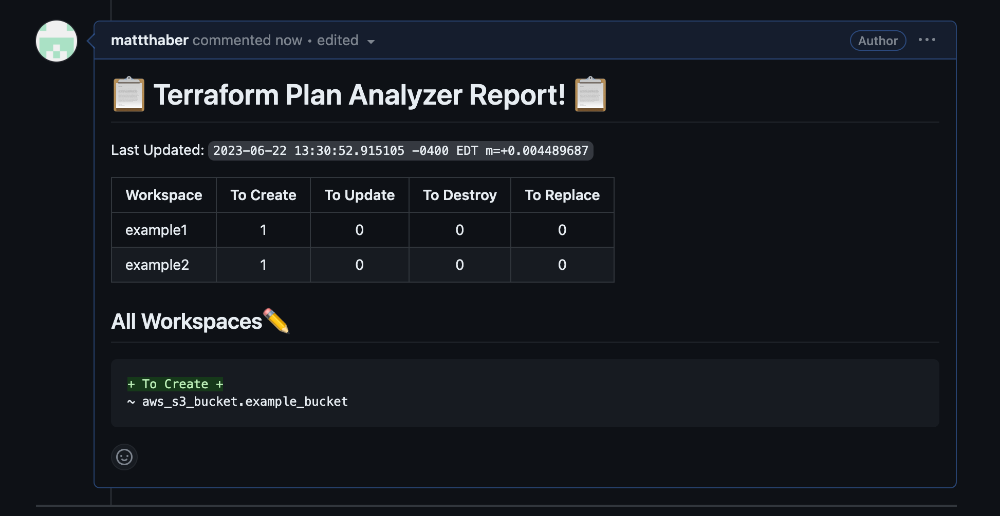

# Terraform Plan Analyzer
[](https://github.com/u21-public/terraform-plan-analyzer/actions/workflows/cicd.yml)

[](https://github.com/u21-public/terraform-plan-analyzer/blob/master/LICENSE)

`terraform-plan-analyzer` is a cli-tool used to compare the terraform plan's of multiple workspaces against each other, resulting in a easy to read report of all changes in a given PR.

```
% terraform-plan-analyzer 
NAME:
   Terraform Plan Analyzer - Reads Plans -> Analyzes them -> prints report

USAGE:
   Terraform Plan Analyzer [global options] command [command options] [arguments...]

COMMANDS:
   help, h  Shows a list of commands or help for one command

GLOBAL OPTIONS:
   --tfplans value  Relative path to folder holding tfplans
   --pretty         Pretty prints to console (default: false)
   --github         Posts report to github PR (default: false)
   --help, -h       show help
2023/06/22 12:38:27 Required flag "tfplans" not set
```


<!-- START doctoc generated TOC please keep comment here to allow auto update -->
<!-- DON'T EDIT THIS SECTION, INSTEAD RE-RUN doctoc TO UPDATE -->
**Table of Contents**  *generated with [DocToc](https://github.com/thlorenz/doctoc)*

- [Why?](#why)
- [Design](#design)
- [Usage](#usage)
  - [Binary](#binary)
  - [Docker](#docker)
  - [Github Actions](#github-actions)
- [Rendered Examples](#rendered-examples)
- [Local Development](#local-development)
  - [Pre-requisites](#pre-requisites)
  - [Commands](#commands)
    - [Setup](#setup)
    - [Lint](#lint)
    - [Format](#format)
    - [Build](#build)
    - [Run Unit Tests](#run-unit-tests)
- [Contributing](#contributing)

<!-- END doctoc generated TOC please keep comment here to allow auto update -->

# Why?
Simply put, once you are deploying to large amount of workspaces, reviewing all changes made by a terraform PR becomes incredibly time consuming. It is not reasonable to review every single plan for every PR (especially for huge changesets) as it takes forever and it is very easy to miss changes the more of them you have to review.

In an ideal world, drift doesn't exist either, however this is not the reality for a lot of projects. It is easy for a single workspace to drift away from the others, and you accidentally deploy a change you did not want.

With the above context, this project was created to...
1) Give high level summary of all changes in a readable format
2) Quickly discern if all workspaces have the same change, or if any have drift compared to the others. 

# Design


# Usage 
## Binary
````
% ./terraform-plan-analyzer --tfplans examples/plans_json/basic_example               
2023/06/22 13:00:48 Reading the plans in...` examples/plans_json/basic_example `
Comparing Workspaces...
# :clipboard: Terraform Plan Analyzer Report! :clipboard:
Last Updated: `2023-06-22 13:00:48.464013 -0400 EDT m=+0.006358397`

| Workspace | To Create | To Update | To Destroy | To Replace |
|-|:-:|:-:|:-:|:-:|
| example1-only-creates | 3 | 0 | 0 | 0 |
| example2-2-adds | 2 | 0 | 0 | 0 |
| example3-destroy | 0 | 0 | 1 | 0 |


## Individual Workspaces
### example1-only-creates :pencil2:
```diff
+ To Create +
~ aws_s3_bucket.example_bucket
~ aws_s3_bucket.example_bucket2
~ aws_s3_bucket.example_bucket3
```

### example2-2-adds :pencil2:
```diff
+ To Create +
~ aws_s3_bucket.example_bucket
~ aws_s3_bucket.example_bucket3
```

### example3-destroy :wastebasket:
```diff
- To Destroy -
~ aws_s3_bucket.example_bucket2
```
````
## Docker
````
% docker pull ghcr.io/u21-public/terraform-plan-analyzer:0.4.0  
% docker run -v ./examples/:/examples ghcr.io/u21-public/terraform-plan-analyzer:0.4.0 --tfplans /examples/plans_json/basic_example
2023/06/22 18:25:15 Reading the plans in...` examples/plans_json/basic_example `
Comparing Workspaces...
# :clipboard: Terraform Plan Analyzer Report! :clipboard:
Last Updated: `2023-06-22 18:25:15.707233069 +0000 UTC m=+0.079645794`

| Workspace | To Create | To Update | To Destroy | To Replace |
|-|:-:|:-:|:-:|:-:|
| example1-only-creates | 3 | 0 | 0 | 0 |
| example2-2-adds | 2 | 0 | 0 | 0 |
| example3-destroy | 0 | 0 | 1 | 0 |


## Individual Workspaces
### example1-only-creates :pencil2:
```diff
+ To Create +
~ aws_s3_bucket.example_bucket
~ aws_s3_bucket.example_bucket2
~ aws_s3_bucket.example_bucket3
```

### example2-2-adds :pencil2:
```diff
+ To Create +
~ aws_s3_bucket.example_bucket
~ aws_s3_bucket.example_bucket3
```

### example3-destroy :wastebasket:
```diff
- To Destroy -
~ aws_s3_bucket.example_bucket2
```
````

## Github Actions
1) Archive plans as json
```
  run-service-plan:
    name: terraform plans
    runs-on: ubuntu-latest
    strategy:
      fail-fast: false
      matrix: 
        workspace: [dev, stg, prod]
    steps:
      - name: Terraform plan
        id: plan
        run: |
          terraform plan -out=tfplan-${{ matrix.workspace }} -input=false
          terraform show -json tfplan-${{ matrix.workspace }} > tfplan-${{ matrix.workspace }}.json
        shell: bash
      - name: Archive Plans
        uses: actions/upload-artifact@v3
        with:
          name: tfplans
          path: |
            tfplan-{{ matrix.workspace }}.json
```
2) Unarchieve plans and analyze them 
```
  analyze-plans:
    runs-on: ubuntu-latest
    needs:[run-service-plan]
    steps:
      - name: download plans
        uses: actions/download-artifact@v3
        with:
          name: tfplans
          path: tfplans
      - name: Run Analyzer
        shell: bash
        run:|
          docker run \
            -v ./examples/:/examples \
            ghcr.io/u21-public/terraform-plan-analyzer:0.4.0 \
            --tfplans /examples/plans_json/basic_example
```

# Rendered Examples
**Only unique changes**  


**Only shared changes**  


**Some shared some unique**  


# Local Development

## Pre-requisites

- [Go](https://golang.org/dl/) v1.20

## Commands
### Setup
```
make setup
```
### Lint
```
make lint
```
### Format
```
make fmt
```
### Build
```
make build
```
### Run Unit Tests
```
make tests
```
# Contributing

Please refer to [contributing guide](./CONTRIBUTING.md).
